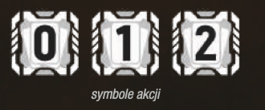

# Akcje graczy

Tutaj są podstawowe informacje o akcjach graczy.

- Wymagania:
    - Aby wykonywać akcje, należy posiadać karty akcji. 
    - Karty skażenia nie liczą się do kart akcji.

### Płacenie za akcje

- Jak to wygląda:
    - Aby móc wykonać daną akcję, należy zapłacić jej koszt. 
    - Płatność polega na odrzuceniu danej ilości kart akcji z ręki.
    - Kartami skażenia nie można płacić.

Koszt jest oznaczony symbolem akcji.

### Jakie są dostępne akcje?
Sprawdź w menu :wink: