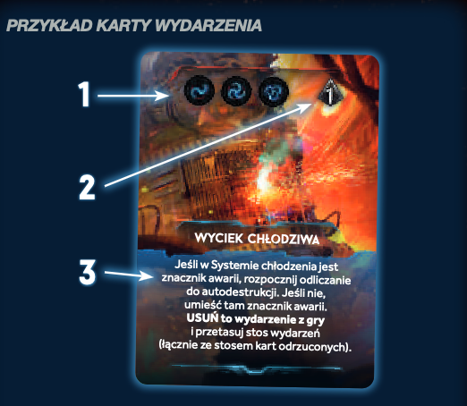
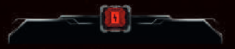

# Karta wydarzenia

Dobieracie i rozgrywacie jedną kartę wydarzenia!

- Ruch nocnych łowców
    - Wszyscy nocni łowcy dla których:
        - Symbol znajduje się na karcie (1)
        - Nie są zaangażowani w walkę z postacią
    - Przechodzą do sąsiedniego korytarzem o numerze z karty (2)
        - Jeśli idą tam, gdzie jest postać, to po prostu idą i tyle
        - Jeśli są tam drzwi, to zostają one zniszczone i łowca nie przechodzi
        - Jeśli jest więcej niż jeden numer, to idą nimi po kolei
            - Jeśli po danym przejściu już jest w pomieszczeniu z postacią, to po prostu tam zostaje i tyle
        - Jeśli numer na karcie wskazuje korytarz techniczny:
            - Należy usunąć figurkę danego łowcy z planszy
            - Dołożyć do woreczka losowy żeton tego samego rodzaju
                - Losowy, bo nawet jeśli zamienię przykładowo dorosłego osobnika na innego, to ma on inne statystyki 

- Efekt wydarzenia
    - Rozpatrz efekt opisany na karcie (3) 
    - Jeśli karta ma dodatkowy efekt `W ciemności` to go rozpatrz gdy:
    
        - W danym sektorze nie ma zasilania 
      
- Po rozegraniu:
    - Odrzuć kartę na stos kart odrzuconych
        - O ile tekst na karcie nie mówi inaczej
    - Jak się wyczerpie stos kart, to je potasuj oraz utwórz nowy stos