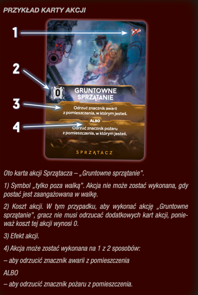

# Akcje z kart akcji

- :moneybag: zgodnie z numerem na karcie + sama karta
- upewniam się patrząc na prawy górny róg karty, czy na pewno mogą wykonać danę akcję w danej chwili
- odrzucam kartę do stosu kart odrzuconych
- wykonuję akcję opisaną na karcie

??? info "Kliknij, aby zobaczyć przykład karty akcji"
    