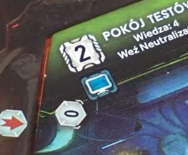

# Akcje komputera

- Wymagania:
    - Odpowiednia ilość kart akcji dla danej akcji komputera 
    - Aktywne zasilanie w danym sektorze
    - Akcja pomieszczenia ma kafelek komputera
    - 
    - Brak znacznika awarii w pomieszczeniu
    - Gracz oczywiście musi się znajdować w danym pomieszczeniu :grin:
- Konsekwencje:
    - Gracz może wykonać 1 z 3 dostępnych akcji
    - Gracz kładzie kartę na sam spód stosu i odkrywa kolejną
        - Jeśli odkrył kartę `Lockdown`, natychmiast rozpatruję się jej efekt
        - [Umieszczam znacznik awarii](../../powtarzalne/awaria/umieszczam-awarie) tam gdzie jestem
        - Tasuję karty komputera i odkrywam wierzchnią kartę z talii (TODO: to nie może być karta Lockdown??)
    - podnoszę poziom wiedzy o jeden

