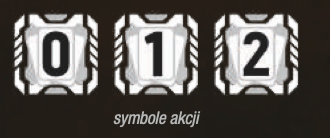
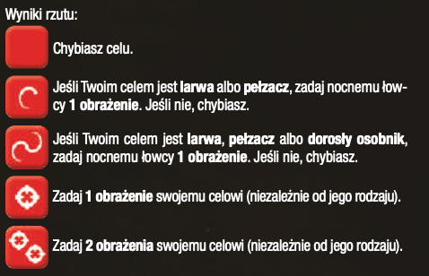
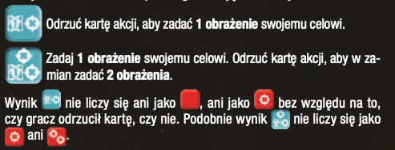

# Akcje graczy

Aby wykonywać akcje, należy posiadać karty akcji. 
Karty skażenia nie liczą się do kart akcji.

TODO: ogólnie weź podziel jakoś this stronę, o ile się da XD

### Płacenie za akcje

Aby móc wykonać daną akcję, należy zapłacić jej koszt. 

Płatność polega na odrzuceniu danej ilości kart akcji z ręki.

Kartami skażenia nie można płacić.

Koszt jest oznaczony symbolem akcji.

### Rodzaje akcji

- W grze jest 6 rodzajów akcji:
    - Akcje poza walką
    - Akcje w trakcie walki
    - Akcje z kart akcji
    - Akcje z kart przedmiotów
    - Akcje pomieszczeń
    - Akcje komputera

### Akcje poza walką

- #### Ruch
    - Ogólne zasady co do ruchu:
        - Nie mogę się przemieszczać przez korytarze techniczne, no chyba że mam do tego specjalną kartę 
        - Nie mogę być zaangażowany w walkę
        - Nie mogę iść do zamkniętego pomieszczenia TODO: no chyba że mogę? XD
        - Na spokojnie mogę iść gdy drzwi są otwarte lub zniszczone
        - [Gdy trafiam do nieodkrytego pomieszczenia (takie które ma żeton eksploracji) to je odkrywam na samym początku](pomieszczenia/odkrywam/odkrywam-pomieszczenie.md)
    - ##### Podstawowy Ruch
        - Wymagania: 
            - Mam minimum jedną kartę akcji
        - Konsekwencje
            - [Wykonuję rzut na szmery](rzut-na-szmery/rzut-na-szmery.md), gdy:
                - w pomieszczeniu nie ma żadnego nocnego łowcy ani gracza 
    - ##### Ostrożny Ruch
        - Wymagania: 
            - Mam minimum dwie karty akcji
            - Chociaż jeden korytarz prowadzący do pomieszczenia gdzie chcę iść, nie ma znacznika szmeru
            - Nie jestem zaangażowany w walkę
            - TODO: oraz nikogo tam nie ma????
        - Konsekwencje:
            - Nie wykonuje rzutu na szmery
            - Po ostrożnym ruchu umieszczam w wybranym przez siebie miejscu znacznik szmeru, gdy nie ma tam żadnego Nocnego Łowcy ani postaci

- #### Podnoszenie ciężkiego obiektu
    - :moneybag: 1 karta akcji
    - Mogę przeszukiwać gdy jest awaria
    - TODO: Mogę gdy jest pożar?
    - TODO: Mogę, gdy jest nocny łowca lub gracz??
    - podnieś wybrany obiekt do ręki, o ile masz miejsce: 
        - żeton zwłok postaci
        - żeton truchła 
        - żeton jaja

### Upuszczenie przedmiotu
- Upuszczanie w dowolnym momencie gry za darmo jest
- Mogę na danym pomieszczeniu opuścić:
   - żeton zwłok postaci
   - żeton truchła 
   - żeton jaja 
- Upuszczonego przedmiotu nie może podnieść inny gracz
    - Kartę przedmiotu kładę na odrzucony stos kart danego przedmiotu 
    - TODO: jakieś trochę takie bez sensu się to wydaje XD 

- #### Handel
    - :moneybag: koszt 1 karta akcji   
    - mogę przekazywać zarówno obiekty jak i przedmioty
    - można ze wszystkimi postaciami z tym samym pomieszczeniu:
        - nawet te które spasowały
    - przekazująć broń, przekazuję też znaczniki amunicji
    - mogę coś oddać, nie muszę dostawać niczego w zamian
- #### Robienie przedmiotu
    - W grze jest generalnie 5 przedmiotów samoróbek
    - odrzuć 2 karty przedmiotów oznaczonych specjalnym niebieskim kolorem aby otrzymać samoróbkę która ma te same symbole na dole, ale w kolorze szarym
    - nie mogę zrobić samoróbki, jeśli mam dostępne przedmioty, ale karta samoróbki nie jest dostępna
        - TODO: to z góry wydaje się bez sensu, jakieś takie lipne XD
    - Oczywiście przedmiot lekki do plecaka, ciężki do ręki
- #### Niszczenie jaj
    - Wymagania: 
        - Gracz jest w pomieszczeniu gdzie leżą przez nikogo nie noszone jaja
        - Gracz nie może być zaangażowany w walkę
    - Konsekwencje:
        - Każde dowolne [zadane obrażenie niszczy jajo](..%2Fpowtarzalne%2Fdostaje-rane%2Flowca-dostaje-rane.md)
        - Walcząc wręcz, gracz nie dobiera karty skażenia
        - W przypadku gdy łowca chybia, gracz nie otrzymuje żadnej rany
        - Po każdej próbie zniszczenia jaja, [gracz wykonuje rzut na szmery](rzut-na-szmery/rzut-na-szmery.md)

### Akcje w trakcie walki

`Info` Walka jest wtedy, gdy w pomieszczeniu gracza znajduje się Nocny Łowca

- Atak na Nocnego Łowcę

- #### O czym warto pamiętać
    - Zwróć uwagę na odkryte słabości, które możesz wykonać
    - Zwróć uwagę na dodatkowe efekty z broni
    - Zwróć uwagę na dodatkowe efekty z kart, jeśli jakieś są
    - Nie da się strzelać do innego gracza
    - Jajo i Larwa giną po każdym obrażeniu
        - Leci też wtedy symbol truchła na planszę 

- #### Strzał
    - Wymagania:
        - Nocny Łowca musi się znajdować z Tobą w pomieszczeniu
        - Gracz musi mieć minimum 1 znacznik amunicji w broni
        - :moneybag: 1 karta akcji
    - Jak wygląda strzał:
        - wybierz broń i 1 nocnego łowcę, którego chcesz zastrzelić
        - odrzuć znacznik amunicji z karty broni
        - rzuć kością walki i rozpatrz rezultat:
            - w pomieszczeniu z zasilaniem rzuć czerwoną kością walki
            ??? "Dowiedz się więcej o rezultacie rzutu kością walki"
                
            - w pomieszczeniu bez zasilania rzuć kością przewagi
            ??? "Dowiedz się więcej o rezultacie rzutu kością przewagi"
                
        - Oznacz, ile obrażeń dostał Nocny Łowca i sprawdź, [czy zmarł](..%2Fpowtarzalne%2Fdostaje-rane%2Flowca-dostaje-rane.md)
            - Nalepa Note: To brzmi ciut kontrintuicyjnie, bo z góry nie wiem ile ma życia
- #### Walka wręcz
    - Atakujesz nocnego łowcę gołymi rękoma albo, prowizoryczną bronią
    - Wymagania:
        - :moneybag: 1 karta akcji
        - Nocny Łowca musi się znajdować z Tobą w pomieszczeniu
        - Mogę rzucać tylko czerwoną kością walki niezależnie od zasilania
    - Konsekwencje:
        - Po opłaceniu dobieram do stosu kart odrzuconych 1 kartę skażenia 
        - Wynik kości walki:
            - Pusta ściana
                - Chybiam i [dostaję 1 odkrytą głęboką ranę](../../powtarzalne/dostaje-rane/dostaje-rane)
            - 1 obrażenie
                - Zadaje po prostu [jedno obrażenie łowcy](..%2Fpowtarzalne%2Fdostaje-rane%2Flowca-dostaje-rane.md)
            - 2 obrażenia
                - I tak [zadaję tylko 1 obrażenie, bo to walka wręcz](..%2Fpowtarzalne%2Fdostaje-rane%2Flowca-dostaje-rane.md)
            - Pełzacz
                - Walczę z pełzaczem albo kimś słabszym, [to zadaję 1 ranę i sprawdzam, czy zmarł](..%2Fpowtarzalne%2Fdostaje-rane%2Flowca-dostaje-rane.md)
                - Walczę z kimś silniejszym, chybiam i [dostaję 1 odkrytą głęboką ranę](../../powtarzalne/dostaje-rane/dostaje-rane)
            - Dorosły osobnik
                - Walczę z dorosłym osobnikiem albo kimś słabszym, to [zadaję 1 ranę i sprawdzam, czy zmarł](..%2Fpowtarzalne%2Fdostaje-rane%2Flowca-dostaje-rane.md)
                - Walczę z kimś silniejszym, chybiam i [dostaję 1 odkrytą głęboką ranę](../../powtarzalne/dostaje-rane/dostaje-rane)
- #### Ucieczka
- Wymagania:
    - :moneybag: 1 karta akcji
    - Mogę tylko wtedy, gdy chcę wykonać ruch, a jestem zaangażowany w walkę
    - Rozpatruję [Atak Nocnego Łowcy](../../faza-wydarzen/atak-nocnego-lowcy/atak-nocnego-lowcy)

### Przeszukanie
- Wymagania:
    - :moneybag: Tyle ile mówi karta 
    - Są jeszcze jakieś przedmioty w pomieszczeniu
    - Dostaję przedmiot w danym kolorze zgodnie z symbolem karty
        - Biały oznacza, że mogę wybrać cokolwiek
            - Oprócz samoróbki 
    - TODO: a co jak jest pożar?
    - TODO: a co jak jest awaria?
    - TODO: a co jak jest łowca?
- Konsekwencje:
    - Gdy chcę wziąć ciężki przedmiot do ręki i nie mam miejsca, to albo go nie biorę, albo zostawiam jakiś ciężki przedmiot
    - Gdy biorę lekki przedmiot, to po prostu kładę go do plecaka
    - Zmniejszam licznik przedmiotów w pomieszczeniu

### Akcje z kart akcji

- :moneybag: zgodnie z numerem na karcie + sama karta
- upewniam się patrząc na prawy górny róg karty, czy na pewno mogą wykonać danę akcję w danej chwili
- odrzucam kartę do stosu kart odrzuconych
- wykonuję akcję opisaną na karcie

??? info "Kliknij, aby zobaczyć przykład karty akcji"
    

### Akcje z kart przedmiotów

- :moneybag: zgodnie z numerem na karcie + sama karta
- odrzucam kartę na stos kart odrzuconych dla danego przedmiotu
- wykonuję kartę danej akcji

### Akcje pomieszczeń
- [Tutaj jest lista pomieszczeń](pomieszczenia/pomieszczenia.md)

### Akcje komputera

- Wymagania:
    - Odpowiednia ilość kart akcji dla danej akcji komputera 
    - Aktywne zasilanie w danym sektorze
    - Akcja pomieszczenia ma kafelek komputera
    - 
    - Brak znacznika awarii w pomieszczeniu
    - Gracz oczywiście musi się znajdować w danym pomieszczeniu :grin:
- Konsekwencje:
    - Gracz może wykonać 1 z 3 dostępnych akcji
    - Gracz kładzie kartę na sam spód stosu i odkrywa kolejną
        - Jeśli odkrył kartę `Lockdown`, natychmiast rozpatruję się jej efekt
        - [Umieszczam znacznik awarii](../../powtarzalne/awaria/umieszczam-awarie) tam gdzie jestem
        - Tasuję karty komputera i odkrywam wierzchnią kartę z talii (TODO: to nie może być karta Lockdown??)
    - podnoszę poziom wiedzy o jeden

### Skanowanie kart skażenia
- O ile mi karta akcji pozwala, czy tam ogónie jakaś akcje
- Jeśli mam Zarażenie w kartach na ręce, to umieszczam na karcie postaci Larwy
    - Gdybym już miał Larwę, to umieram:
        - umieszczam zwłoki gracza
        - Pełzacza w tym miejscu
    - TODO: imo bym nie skanował, skoro mam to przecież wiem że mam i bym czekał te X rund