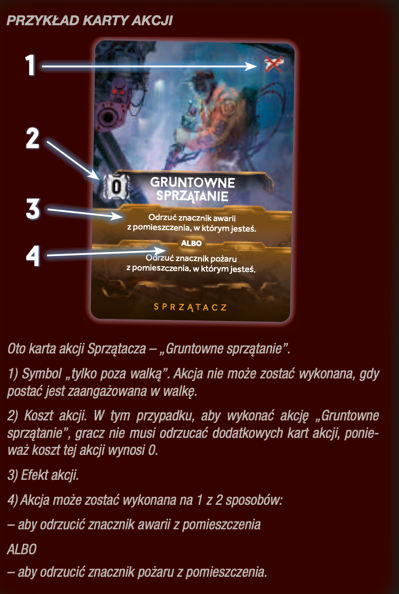

# Akcje graczy

Aby wykonywać akcje, należy posiadać karty akcji. 
Karta skażenia nie liczy się do kart akcji.

- Jest 6 rodzajów akcji:
    - Akcje poza walką
    - Akcje w trakcie walki
    - Akcje z kart akcji
    - Akcje z kart przedmiotów
    - Akcje pomieszczeń
    - Akcje komputera

### Kiedy mogę robić przeszukanie??

- [Przeszukanie](../przeszukanie/przeszukanie.md)

### Akcje poza walką

- Ruch:
    - Ogólne zasady co do ruchu:
        - Nie mogę być zaangażowany w walkę
    - Podstawowy Ruch
        - Wymagania: 
            - Mam minimum jedną kartę akcji
    - Ostrożny Ruch
        - Wymagania: 
            - Mam minimum dwie karty akcji
            - Chociaż jeden korytarz prowadzący do pomieszczenia gdzie chcę iść, nie ma znacznika szmeru
        - Konsekwencje:
            - Nie wykonuje rzutu na szmery
            - Po ostrożnym ruchu umieszczam w wybranym przez siebie miejscu znacznik szmeru 
            - TODO: Mogę iść ostrożnie do pomieszczenia gdzie jest nocny łowca?

- Podnieś ciężki obiekt:
??? info "Kliknij, aby dowiedzieć się więcej"
    - :moneybag: 1 karta akcji
    - podnieś wybrany obiekt do ręki, o ile masz miejsce: 
        - żeton zwłok postaci
        - żeton truchła 
        - żeton jaja
    - w przypadku gdy podnoszę przedmiot do plecaka, np. w wyniku przeszukania, to nie płacę nic dodatkowo
- Handel
    - :moneybag: koszt 1 karta akcji   
    - można ze wszystkimi postaciami z tym samym pomieszczeniu, nawet te które spasowały
    - przekazująć broń, przekazuję też znaczniki amunicji
    - mogę coś oddać, nie muszę dostawać niczego w zamian
- Zrób przedmiot
    - odrzuć 2 karty przedmiotów oznaczonych specjalnym niebieskim kolorem aby otrzymać samoróbkę która ma te same symbole na dole, ale w kolorze szarym
    - nie mogę zrobić samoróbki, jeśli mam dostępne przedmioty, ale karta samoróbki nie jest dostępna
    - TODO: to z góry wydaje się bez sensu, jakieś takie lipne XD
    - W grze jest generalnie 5 przedmiotów samoróbek

### Akcje w trakcie walki

- Atak na Nocnego Łowcę

- Ucieczka:
    - :moneybag: 1 karta akcji
    - Mogę tylko wtedy, gdy chcę wykonać ruch, a jestem zaangażowany w walkę

### Akcje z kart akcji

- :moneybag: zgodnie z numerem na karcie + sama karta
- odrzucam kartę do stosu kart odrzuconych
- wykonuję akcję opisaną na karcie

??? info "Kliknij, aby zobaczyć przykład karty akcji"
    

### Akcje z kart przedmiotów

- :moneybag: zgodnie z numerem na karcie + sama karta
- odrzucam kartę na stos kart odrzuconych dla danego przedmiotu
- wykonuję kartę danej akcji

### Akcje pomieszczeń

- :moneybag: zgodnie z numerem na karcie
- Wykonuje kartę danego pomieszczenia
- [Tutaj jest lista pomieszczeń](pomieszczenia/pomieszczenia.md)

### Akcje komputera

- Wymagania:
    - Odpowiednia ilość kart akcji dla danej akcji komputera 
    - Aktywne zasilanie w danym sektorze
    - Akcja pomieszczenia ma kafelek komputera
    - Brak znacznika awarii w pomieszczeniu
    - Gracz oczywiście musi się znajdować w danym pomieszczeniu :grin:
- Konsekwencje:
    - Gracz może wykonać 1 z 3 dostępnych akcji
    - Gracz kładzie kartę na sam spód stosu i odkrywa kolejną
        - Jeśli odkrył kartę `Lockdown`, natychmiast rozpatruję się jej efekt 
