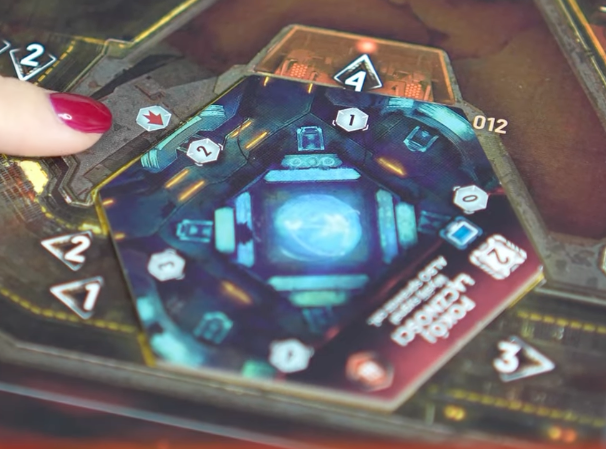

# Odkrywam pomieszczenie!

## Ustawiam licznik przedmiotów

## Co jest na żetonie eksploracji?

- [Znacznik Pożaru](pozar/pozar.md)
- [Znacznik Awarii](awaria/awaria.md)
- [Znacznik Drzwi](drzwi/drzwi.md)
- [Znacznik Ciszy](cisza/cisza.md)
- [Znacznik Niebezpieczeństwa](../../../rzut-na-szmery/niebezpieczenstwo/niebezpieczenstwo)
- [Znacznik Śluzu](sluz/sluz.md)