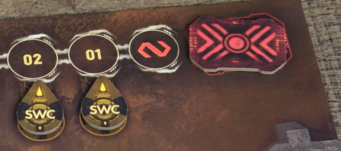
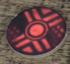

# Pomieszczenia

Tutaj jest lista pomieszczeń wraz z akcjami.

### Ogólne wymagania:
- Wymagania:
    - :moneybag: zgodnie z numerem na karcie
    - Pomieszczenie nie może być zepsute 
    - Musi być symbol zasilania
        - Nalepa info: To bym stosował tylko w przypadku pomieszczeń z komputerem?
    - Nie można wykonywać akcji pomieszczenia w trakcie walki z Nocnym Łowcą
- Konsekwencje:
    - Wykonuje kartę danego pomieszczenia

### Zasilanie Awaryjne
- Wykonaj te rzeczy:
    - Zresetuj zasilanie
        - nie rób, jeśli są 3 żetony zasilania zwrócone ku górze
    - ustaw zasilanie
        - rozmieść żetony zasilania tak jak chcesz
    - ustaw żeton czasu aktywną stroną ku górze, czyli na niebieski kolor
        - jeśli był nieaktywny, czyli czerwony

### Centrum Szybkiego Reagowania
- Tutaj mogę:
    - Sprawdzić żeton planu awaryjnego z puli neutralnej
        - Drogą dedukcji może mi to pomóc ocenić, jaki jest obowiązujący plan awaryjny
        
    - Aktywować procedurę alarmową
        - Podziel numer pola, na którym się znajduje żeton czasu przez 2 i zaokrąglij w dół
        - Przykładowo: 11 / 2 = 5.5 => 5 
        - Umieść tam żeton planu awaryjnego
         
        

        - Natychmiast otwiera się Izolatka i postacie mogą się w niej zamykać

### Komora dekontaminacyjna
- Tutaj mogę:
    - Usunąć znacznik śluzu
    - Przeskanować wszystkie karty zarażenie, które mam na ręce i je usunąć
        - Jeśli mam larwę, to też ją usuwam

### Gabinet Chirurgiczny
- Skanuje wszystkie karty skażenia z dowolnego miejsca, jakie mam
    - usuwam te, które są zarażone
    - jak mam larwę na planszy, to usuwam ją
    - [dostaję 1 powierzchowną ranę](..%2F..%2Fpowtarzalne%2Fdostaje-rane%2Fdostaje-rane.md)
    - automatycznie pasuje
    - formuje nowy stos kart akcji ze wszystkich kart

### Ambulatorium
-  Tutaj mogę:
    - Wyleczyć całkowicie 1 wybraną głęboką ranę
    - Opatrzyć wszystkie głębokie rany
        - czyli je odwrócić
    - Uleczyć wszystkie powierzchowne rany

### Centrum kontroli wysyłki CARGO
- Tutaj mogę:
    - podejrzeć wybrany żeton SWC
        - i go przesunąć o jedno pole w prawo lub lewo
            - o ile nie ma tam znacznika czasu
            - ani innego żetonu SWC

### System wysyłki CARGO A
- Wymagania:
    - tylko wtedy, gdy żeton czasu znajduje się na polu którym leży dowolny żeton SWC
    - kapsuła A jest pusta
- Konsekwencje:
    - odrzucam wszystkie karty z ręki i robię PAS  
    - umieszczam figurkę w danym polu kapsuły
    - nie wpływają na mnie żadne efekty z gry
        - chyba że zaznaczono na jakiejś karcie inaczej 

### System wysyłki CARGO B
- Analogicznie jak wyżej

### System wysyłki CARGO C
- Analogicznie jak wyżej

### System Chłodzenia
- Tutaj mogę:
    - rozpocząć procedurę odliczania do autodestrukcji
        - weź żeton autodestrukcji i umieść go na torze czasu o 3 pola na prawo
            - 2 pola toru czasu będą wtedy puste
        - umieść go żółtą stroną ku górze
        - dopóki żółta strona jest widoczna, można przerwać odliczanie

### Generator
- Tutaj mogę:
    - Włączyć zasilanie w danym sektorze   
    - Wyłączyć zasilanie w danym sektorze   
    - Zatrzymać procedurę autodestrukcji, gdy żeton jest zwrócony żółtą stroną ku górze

### Laboratorium
- Tutaj mogę:
    - przebadać 
        - jedno z wybranych:
            - zwłoki postaci
            - truchło
            - jajo
        - następnie podnoszę wtedy poziom wiedzy postaci o 3
        - kładę przebadany obiekt na pustym polu planszy lab od lewej
            - jeśli dany obiekt nie został przebadany jeszcze, to
                - odkrywam słabość Nocnego Łowcy
            - jak został, to po prostu odrzucam obiekt do puli ogólnej

### Gniazdo
- Gracz, który je odkrył, natychmiast podnosi poziom wiedzy o 1
- Tutaj mogę:
    - wziąć 1 żeton jaja z laboratorium nocnych łowców
        - ale wtedy muszę wykonać rzut na szmery
    - niszczyć jaja:
        - jeśli wszystkie są zniszczone, to gniazdo uznaje się za zniszczone
            - umieszczam wtedy znacznik amunicji
    - jeśli w fazie wydarzeń, dokładniej skutki pożarów, są tutaj jakieś jaja, to niszczę 1 z nich
        - Nalepa info: Może mogę wtedy zniszczyć wszystkie?

### Archiwum
- Wymagania:
    - tylko wtedy, gdy mój żeton wiedzy jest nieaktywny 
- Tutaj mogę:
    - podnieś poziom wiedzy o dwa
        - obrócić żeton wiedzy na aktywną stronę
        - podejrzyj treść dowolnego żetonu planu awaryjnego
            - nie licząc tego na końcu toru czasu

### Wejście do jaskini
- Przenieś się do dowolnego odkrytego pomieszczenia z wejściem do korytarzy technicznych
    - [Rozpatrz 1 kartę ataku Nocnego Łowcy](..%2F..%2Ffaza-wydarzen%2Fatak-nocnego-lowcy%2Fatak-nocnego-lowcy.md)
        - atak przeprowadza 1 dorosły osobnik
        - aktywny jest efekt ciemności

### Ciągi ewakuacyjne
- Tutaj zawsze jestem w ciemności

### Magazyn
- Robię przedmiot
    - nie muszę mieć wtedy 2 kart przedmiotów potrzebnych do zrobienia samoróbki, jedna wystarczy 

### Izolatka
- Tutaj mogę:
    - Dobrać do 6 kart akcji, jak moja postać tutaj zaczyna rundę
        - To nie działa, jeśli jest znacznik awarii
    - Zamknąć się w środku
        - gdy procedura alarmowa jest aktywna
        - gdy żeton czasu jest na biały polu, czyli od 8
        - Wtedy wykonuje [rzut na szmery](..%2Frzut-na-szmery%2Frzut-na-szmery.md)
            - jak się pojawi dowolny nocny łowca, to nie udaje mi się zamknąć
            - jak nie, to zamykam się w Izolatce
                - jestem już tylko obserwatorem 
                - [czekam na koniec gry](..%2F..%2Fkoniec-gry%2Fkoniec-gry.md)

### Szyb Windy S-01
- Musi mieć aktywne zasilanie
- Nie mogę być zaangażowany w walkę
- Wtedy mogę:
    - wezwać windę, gdy jest w innym miejscu
    - skorzystać z windy, gdy jest obok mnie
        - mogę kogoś zabrać, jeśli chce
        - nie wykonuje rzutu na szmery:
            - Nalepa info: A może by jednak wykonywać?

### Szyb Windy S-03
- Jak wyżej

### Szyb Windy S-03
- Jak wyżej

### Pokój łączności
- Tutaj mogę:
    - wysłać sygnał
        - umieszczam znacznik statusu na swojej planszy
    - sprawdzić cel innego gracza
        - o ile wysłał już sygnał 
        - musi mi go w sekrecie pokazać 

### Kwatera straży
- Zmniejszam wartość przedmiotów o 1 i biorę jedną z tych kart ze stosu samoróbek, o ile są:
    - Paralizator
    - Skafander Kosmiczny
    - Nalepa info: Biorę kartę, jak nie ma już, to sobie na jakiejś kartce ją dorysuję :grin:

### Skażone pomieszczenie
- Za każdym razem, gdy je przeszukuje, umieszczam znacznik śluzu

### Kontrola Systemu Wentylacji
- Wybieram pomieszczenie gdzie:
    - jest wejście do korytarzy technicznych
    - żadne drzwi obok nie są zniszczone
- Konsekwencje:
    - Zamykam wszystkie drzwi
    - Usuwam znacznik pożaru, jeśli jakiś był
    - Umieszczam znacznik wentylacji
    - Jeśli przed zakończeniem fazy graczy drzwi zostaną zniszczone, to usuwam znacznik wentylacji
    - Jeśli zaczynam fazę wydarzeń, a znacznik wciąż tam jest, to każda postać i nocny łowca tam umiera
        - i usuwam wtedy znacznik wentylacji

### Kontrola Systemów Obronnych
- Wymagania:
    - zmniejsz ilość przedmiotów o 1
    - albo umieść znacznik awarii
- Konsekwencje:
    - Wybierz pomieszczenie bez znacznika awarii
    - Umieść tam awarię
    - Każdy nocny łowca co tam jest, [otrzymuje po 1 obrażeniu](..%2F..%2Fpowtarzalne%2Fdostaje-rane%2Flowca-dostaje-rane.md)
    - Każda postać co tam jest, [otrzymuje 1 głęboką ranę](..%2F..%2Fpowtarzalne%2Fdostaje-rane%2Fdostaje-rane.md)

### Pokój testów
- Wymagania:
    - Poziom postaci wynosi co najmniej 4
- Konsekwencje:
    - Biorę neutralizator ze stosu samoróbek, o ile jest
        - Nalepa info: Biorę kartę, jak nie ma już, to sobie na jakiejś kartce ją dorysuję :grin:

### 001 - Ucieczka do Bunkra
- Wymagania:
    - postać znajduję się na kafelku obok bramy głównej
    - w pomieszczeniu nie ma postaci nocnego łowcy
    - brama jest otwarta
    - łazik jest dostępny
        - lub postać ma skafander kosmiczny 
    - w razie czego da się jakoś sprowadzić zdalnie łazik do bazy
- Konsekwencje:
    - wtedy wykonuje [rzut na szmery](..%2Frzut-na-szmery%2Frzut-na-szmery.md)
        - jak się pojawi dowolny nocny łowca, to nie udaje mi się zamknąć
        - jak nie, to zamykam się w Izolatce
            - jestem już tylko obserwatorem 
            - [czekam na koniec gry](..%2F..%2Fkoniec-gry%2Fkoniec-gry.md)

### Bunkier
- Może być tam więcej niż 1 postać
- Nie jest niszczony przez awarię ani pożary
- Nie jest niszczony, gdy baza jest niszczona
