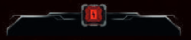

# Karta wydarzenia

Dobieracie i rozgrywacie jedną kartę wydarzenia!

- Ruch nocnych łowców
    - Wszyscy nocni łowcy dla których:
        - Symbol znaduje się na karcie (1)
        - Nie są zaangażowani w walkę z postacią
    - Przechodzą do sąsiedniego korytarzem o numerze z karty (2)
        - TODO: jeśli idą tam gdzie jest postać, to zostawiamy znaczniki szmerów? Czy usuwamy? Imo bym usuwał 
        - Jeśli są tam drzwi, to zostają one zniszczone i łowca nie przechodzi
        - Jeśli jest więcej niż jeden numer, to idą nimi po kolei
            - Ale jeśli po danym przejściu już jest w pomieszczeniu z postacią, to nie idzie dalej
            - TODO: Należy rozpatrzeć Spotkanie z Nocnym Łowcą?
                - tak, to jest default wg zasad, bo przyszedł tutaj nagle XD
                    - w takiej sytuacji weź wydziel gdzieś spotkanie z nocnym łowcą osobno 
                - nie, bo co za dużo to nie zdrowo XD
        - Jeśli numer na karcie wskazuje korytarz techniczny:
            - Należy usunąć figurkę danego łowcy z planszy
            - Dołożyć do woreczka losowy żeton tego samego rodzaju
                - Losowy, bo nawet jeśli zamienie przykładowo dorosłego osobnika na innego, to ma on inne statystyki 

- Efekt wydarzenia
    - Rozpatrz efekt opisany na karcie (3) 
    - Jeśli karta ma dodatkowy efekt `W ciemności` to go rozpatrz gdy:
    
        - W danym sektorze nie ma zasilania 
      
- Po rozegraniu:
    - Odrzuć kartę na stos kart odrzuconych
        - No chyba że tekst mówi inaczej
    - Jak się wyczerpie stos kart, to weź je potasuj i utwórz nowy stos