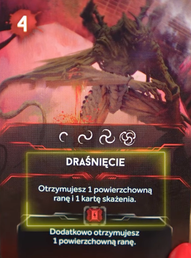

# Atak nocnego łowcy

### Gdy rozgrywam w Fazie wydarzeń
- Każdy nocny łowcy w pomieszczeniu z postacią wykonuje atak
    - Jeśli jest więcej niż 1 postać w pomieszczeniu, to wybiera tego, co ma najmniej kart akcji na ręce
- A jak jest remis to tego, co jest najwcześniej w kolejności graczy
    - `Nalepa rule` Imo bym tutaj atakował randomowo :D 

### Gdy rozgrywam Spotkanie z Nocnym Łowcą z Zaskoczenia
- Dobierz 1 kartę ataku Nocnego Łowcy i wykonaj atak
- Jeśli jest więcej niż 1 postać w pomieszczeniu, to wybiera tego, co ma najmniej kart akcji na ręce
    - `Nalepa rule` Ja bym wybrał tego, co spowodował atak
- A jak jest remis to tego, co jest najwcześniej w kolejności graczy
    - `Nalepa rule` Imo bym tutaj atakował randomowo :D 

### Rozgrywam, gdy uciekam
- Dobierz 1 kartę ataku Nocnego Łowcy

### Jak wygląda atak?
- Patrzę na szczegóły karty ataku
    - W przypadku ataku królowej patrzę na specjalne dla niej karty ataku

- Czy symbol Nocnego Łowcy jest na karcie?:
    - Tak
        - [Dostaję obrażenia zgodnie z kartą](dostaje-rane.md)
        - Jeśli jestem w ciemności i karta ataku ma efekty w ciemności, to też to rozpatruję
    - Nie
        - To oznacza, że Nocny Łowca chybia i nic mi się nie dzieje

